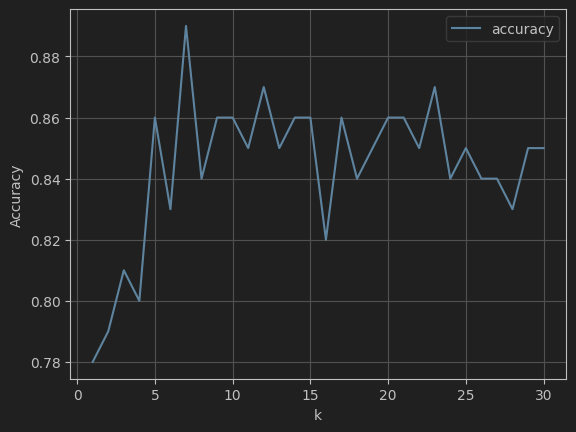

## Introduction

This document outlines the final results of the first part of Assignment 1. A K-Nearest Neighbours algorithm was used to classify pre-processed images of the digits '5' or '6' with their respective labels.

## Performance Chart

The model accuracy given any $k$ tends to increase dramatically until approximately $k = 5$, after which it fluctuates dramatically.

## Optimal $k$ Value

The optimal value found was $k = 7$.

## Cross Validation Accuracy

Testing using $k = 7$, on the training set using 10-fold cross validation yielded an accuracy of 91%.

## Test Accuracy

Testing $k = 7$ on the training set yielded an accuracy of 80.9%.

## Conclusion

In conclusion, the best value for $k$ was found to be $k = 7$, with a cross-validation accuracy of 91% and a test accuracy of approx. 80.9%. 
